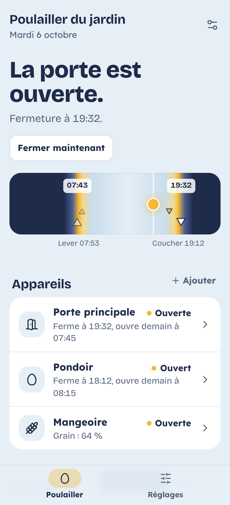
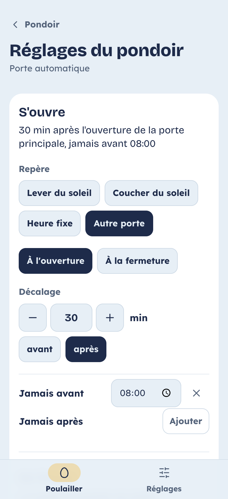

# Solar Chicken

**Ta porte Omlet Smart Autodoor s'ouvre au lever du soleil et se ferme au coucher, sans faute.**
Auto-hébergé, gratuit et open source. [English version](README.md)

<p align="center">
  
  
</p>

> Solar Chicken n'est pas affilié à Omlet Ltd. « Omlet » et « Autodoor » sont des marques d'Omlet Ltd.
> Il pilote ta porte par l'API publique d'Omlet, avec ta propre clé.

## Pourquoi

La Smart Autodoor s'ouvre selon la luminosité ou à heure fixe. Le capteur se trompe sous les arbres et
par soir de pluie ; une heure fixe se décale de plusieurs heures au fil de l'année. Solar Chicken calcule
chaque jour le lever et le coucher du soleil chez toi et fait bouger tes portes en conséquence, avec tes
décalages : *ouvrir 10 min avant le lever, fermer 20 min après le coucher*.

## Fonctions

- **Horaires au lever et au coucher du soleil**, avec décalages et bornes (*jamais avant 08:00*).
- **Plusieurs portes par poulailler**, avec des règles relatives : le pondoir s'ouvre 30 min après la
  porte principale et se ferme 1 h avant le coucher, pour que les poules n'y dorment pas.
- **Ça continue quand quelque chose lâche** : chaque nuit, les horaires du jour sont écrits dans le
  boîtier de chaque porte, qui s'ouvre et se ferme même si ton serveur, ton Wi-Fi ou internet tombe.
- **Chaque action est vérifiée** : si une porte n'a pas bougé, Solar Chicken relance puis t'alerte sur
  Telegram. Les actions manquées sont rattrapées, et aucune commande n'est envoyée deux fois.
- **D'un coup d'œil** : une phrase dit si la porte est ouverte ou fermée et ce qui va se passer ; une
  bande de ciel montre le vrai lever et coucher avec toutes les actions de la journée.
- Planning du jour sur Telegram, historique, état en direct (piles, Wi-Fi, défauts), boutons manuels.
- Capteurs Home Assistant en option. Pensé pour le téléphone, clair et sombre, français et anglais.

## Ce qu'il te faut

- Une porte Omlet **Smart** Autodoor (le modèle Wi-Fi) configurée dans l'application Omlet.
- Une clé API Omlet gratuite, depuis la [console développeur Omlet](https://smart.omlet.com/developers).
- Une machine qui fait tourner Docker en permanence : Raspberry Pi 4 ou 5, NAS, mini-PC…

## Installation

```bash
git clone https://github.com/julien-deudon/solar-chicken.git
cd solar-chicken
./install.sh
```

Ouvre `http://<ta-machine>:3000`, crée ton compte, puis suis l'assistant : position du poulailler,
clé API Omlet, et le rôle de chaque porte (porte principale, pondoir, autre porte).

<details>
<summary>Sans le script</summary>

```bash
cp .env.example .env      # puis renseigne DB_PASSWORD, JWT_SECRET et SECRET_KEY (openssl rand -hex 32)
docker compose up -d
```
</details>

## Comment tes poules restent en sécurité

Chaque porte a un fonctionnement :

| Fonctionnement | Ce qui se passe | Si le serveur est arrêté |
|---|---|---|
| **Horaires dans le boîtier** (par défaut) | Chaque nuit, les horaires du jour sont écrits dans la porte ; Solar Chicken vérifie qu'elle a bougé et envoie lui-même la commande sinon | La porte garde les horaires de la veille, à une ou deux minutes près |
| **Piloté par le serveur** | Solar Chicken envoie *ouvrir* et *fermer* à l'heure exacte, vérifie, relance | Rien ne bouge jusqu'à son retour (garde le mode lumière de la porte en secours) |
| **Surveillance seulement** | État et historique, aucune action automatique | — |

Quand la porte ne confirme pas, tu reçois une alerte Telegram qui dit ce qui s'est passé (porte bloquée,
toujours ouverte après trois essais…).

## Notifications Telegram

1. Écris à [@BotFather](https://t.me/BotFather) et crée un bot : il te donne un jeton.
2. Envoie un message à ton bot, puis récupère ton identifiant de conversation (par exemple avec [@userinfobot](https://t.me/userinfobot)).
3. Dans Solar Chicken : **Réglages → Notifications**, colle les deux et envoie un test.

## Home Assistant (facultatif)

Renseigne `HA_TOKEN` dans `.env`, décommente les lignes `ports` du service `api` dans `docker-compose.yml`,
puis ajoute un [capteur REST](https://www.home-assistant.io/integrations/rest/) qui lit
`http://127.0.0.1:8095/ha/state` avec l'en-tête `Authorization: Bearer <HA_TOKEN>`.
Il renvoie la porte principale, le pondoir, les prochaines heures d'ouverture et de fermeture et un indicateur `alert`.

## Au quotidien

```bash
docker compose pull && docker compose up -d                       # mise à jour
docker compose exec db pg_dump -U solarchicken solarchicken > sauvegarde.sql   # sauvegarde
echo 'nouveau-mot-de-passe' | docker compose exec -T api /app/server reset-password toi@exemple.fr
```

Pour y accéder hors de chez toi, passe par un VPN comme [Tailscale](https://tailscale.com) plutôt que
d'ouvrir un port. Si tu l'exposes quand même, mets-le derrière HTTPS.

## Développement

Le serveur est en Go (`backend/`), l'application web en Next.js (`frontend/`), la base en PostgreSQL.
`bash frontend/dev/start-dev.sh` lance l'application avec une fausse API, sans compte Omlet.
Voir [CONTRIBUTING.md](CONTRIBUTING.md).

## Licence

[AGPL-3.0](LICENSE). Tu peux l'utiliser, le modifier et le partager ; si tu proposes une version modifiée
en service en ligne, partage aussi son code.
