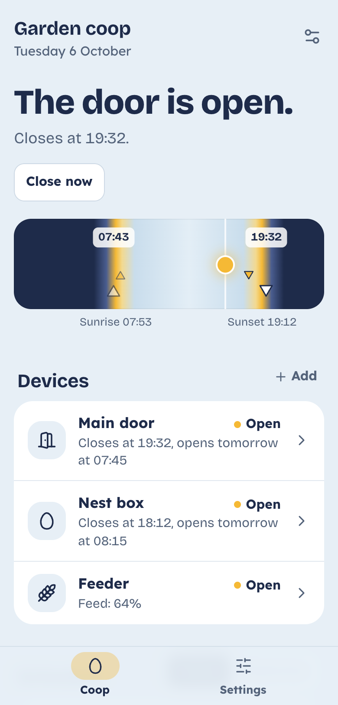
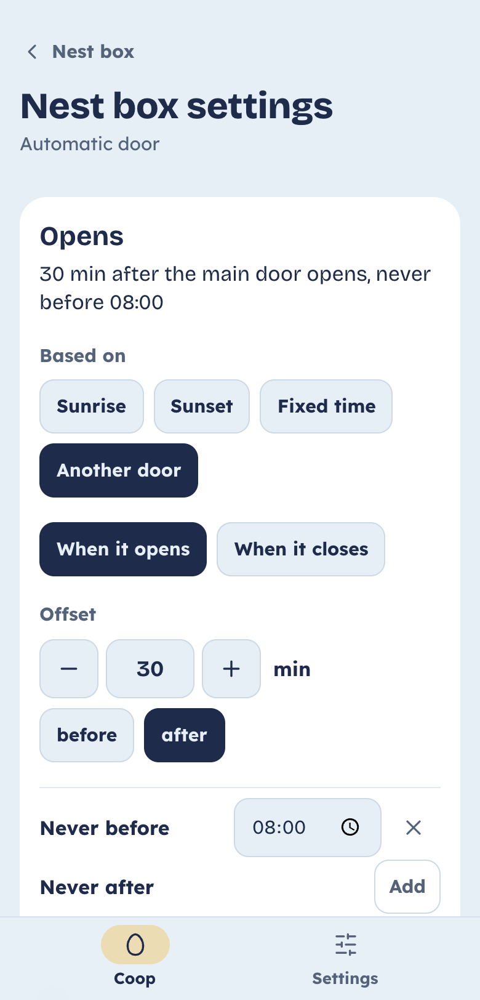

# Solar Chicken

**Open your Omlet Smart Autodoor at sunrise and close it at sunset — reliably.**
Self-hosted, free and open source. [Version française](README.fr.md)

<p align="center">
  
  
</p>

> Solar Chicken is not affiliated with Omlet Ltd. "Omlet" and "Autodoor" are trademarks of Omlet Ltd.
> It talks to your door through Omlet's public developer API, with your own API key.

## Why

The Smart Autodoor opens by light level or at fixed times. Light sensors get fooled by trees and dark,
rainy evenings; fixed times drift by hours over the year. Solar Chicken computes sunrise
and sunset for your coop every day and runs your doors from them, with your own offsets:
*open 10 min before sunrise, close 20 min after sunset*.

## Features

- **Sunrise and sunset schedules** with offsets and limits (*never before 08:00*).
- **Several doors per coop**, with rules relative to each other: by default the nest box opens with the
  main door and closes 2 h before it, so hens don't sleep in it. Every rule can be changed in the app.
- **Keeps working when things break**: every night the day's times are written into each door's own
  control unit, so the door still opens and closes if your server, Wi-Fi or internet is down.
- **Every action is checked**: if a door didn't move, Solar Chicken retries, then warns you on Telegram.
  Missed actions are caught up after an outage, and no command is ever sent twice.
- **At a glance**: one sentence tells you if the door is open or closed and what happens next; a sky
  band shows the real sunrise and sunset with every door event of the day.
- Daily schedule on Telegram, full history, live status (battery, Wi-Fi, faults), manual controls.
- Optional Home Assistant sensors. Mobile-first, light and dark, English and French.

## What you need

- An Omlet **Smart** Autodoor (the Wi-Fi model) set up in the Omlet app.
- A free Omlet API key from the [Omlet developer console](https://smart.omlet.com/developers).
- A machine running Docker around the clock: Raspberry Pi 4 or 5, NAS, mini PC…

## Install

```bash
git clone https://github.com/julien-deudon/solar-chicken.git
cd solar-chicken
./install.sh
```

Open `http://<your-machine>:3000`, create your account, then follow the setup: coop location,
Omlet API key, and which door is the main door, the nest box or another door.

<details>
<summary>Without the script</summary>

```bash
cp .env.example .env      # then set DB_PASSWORD, JWT_SECRET and SECRET_KEY (openssl rand -hex 32)
docker compose up -d
```
</details>

## How it keeps your hens safe

Each door has a mode:

| Mode | What happens | If the server is down |
|---|---|---|
| **Times stored in the unit** (default) | Every night the day's times are written into the door; Solar Chicken checks the door moved and sends the command itself if it didn't | The door keeps yesterday's times, a minute or two off |
| **Server commands** | Solar Chicken sends *open* and *close* at the exact time, checks, retries | Nothing moves until it's back (keep the door's own light mode as a backup) |
| **Monitor only** | Status and history, no automatic action | — |

When the door doesn't confirm, you get a Telegram alert with what happened (jammed, still open after three attempts…).

## Telegram notifications

1. Talk to [@BotFather](https://t.me/BotFather) and create a bot: it gives you a token.
2. Send any message to your new bot, then get your chat ID (for example with [@userinfobot](https://t.me/userinfobot)).
3. In Solar Chicken: **Settings → Notifications**, paste both, and send a test.

## Home Assistant (optional)

Set `HA_TOKEN` in `.env`, uncomment the `ports` lines of the `api` service in `docker-compose.yml`,
then add a [REST sensor](https://www.home-assistant.io/integrations/rest/) reading
`http://127.0.0.1:8095/ha/state` with the header `Authorization: Bearer <HA_TOKEN>`.
It returns the main door, the nest box, the next opening and closing times and an `alert` flag.

## Everyday tasks

```bash
docker compose pull && docker compose up -d                       # update
docker compose exec db pg_dump -U solarchicken solarchicken > backup.sql   # back up
echo 'new-password' | docker compose exec -T api /app/server reset-password you@example.com
```

Reach it from outside your home through a VPN such as [Tailscale](https://tailscale.com) rather than
opening a port. If you do expose it, put it behind HTTPS.

## Development

The backend is Go (`backend/`), the web app is Next.js (`frontend/`), the database is PostgreSQL.
`bash frontend/dev/start-dev.sh` runs the web app against a mock API, no Omlet account needed.
See [CONTRIBUTING.md](CONTRIBUTING.md).

## License

[AGPL-3.0](LICENSE). You can use, change and share it; if you offer a modified version as a service,
share its source code too.
